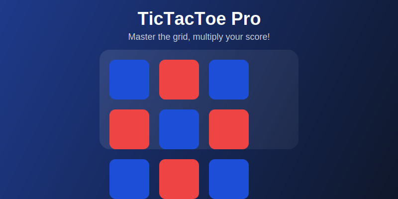

# 🎮 TicTacToe Pro - Base Mini-App# TicTacToe Pro - Base Mini App


> A professional-grade, real-time multiplayer TicTacToe game built as a Base mini-app with blockchain integration, transparent leaderboards, and advanced features.A strategic Tic Tac Toe game built as a Base/Farcaster mini app with multiplier mechanics, leaderboard, and X (Twitter) profile integration.


## Features


## ✨ Features- 🎮 **Strategic Tic Tac Toe Gameplay** - Classic 3x3 grid with smooth animations

- ⚡ **Multiplier System** - Speed bonuses, win streaks, and X ethos score bonuses

### 🎮 Core Gaming- 🏆 **Leaderboard** - Compete with other players and track your ranking

- **6x6 Grid**: Strategic gameplay with 4-in-a-row win condition- 📊 **Points System** - Earn points based on performance and multipliers

- **Real-time Multiplayer**: Instant synchronization via Socket.IO- 🐦 **X Profile Integration** - Connect your X (Twitter) profile for ethos score bonuses

- **Smart Matchmaking**: Skill-based opponent matching- 🎨 **Aesthetic UI** - Modern design with smooth animations and gradients

- **Private Room Codes**: Play with friends using custom codes- 📱 **Mobile Optimized** - Responsive design for all devices

- **Game Modes**: Quick play, ranked matches, and tournaments

## Multiplier System

### ⛓️ Blockchain Integration

- **Base Network**: All game results recorded on-chainThe game features a sophisticated multiplier system that rewards:

- **Transparent Leaderboards**: Immutable rankings on blockchain

- **Achievement NFTs**: Unlock and own your achievements1. **Speed Bonus** - Win in fewer moves for higher multipliers

- **Smart Contracts**: Automated point distribution and verification   - 5 moves or less: +2.0x

   - 6-7 moves: +1.5x

### 🌐 Base Mini-App Features   - 8-9 moves: +1.0x

- **Farcaster Integration**: Native frame support and cast actions

- **Account Association**: Seamless Base account linking2. **Win Streak** - Consecutive wins increase your multiplier

- **Webhook Events**: Real-time notifications and updates   - Each win streak: +0.5x per win

- **Payment Integration**: Coinbase Wallet and Base payments   - Max streak bonus: +5.0x

- **Social Features**: Share achievements and challenge friends

3. **X Ethos Score** - Your X profile's ethos score affects multipliers

### 🏆 Advanced Features   - Ethos score / 100 * 0.5x bonus

- **Achievement System**: 20+ unlockable achievements   - Higher ethos = better rewards

- **Statistics Tracking**: Comprehensive player analytics

- **Tournament Mode**: Competitive bracket-style tournaments## Tech Stack

- **Live Notifications**: Real-time game and achievement alerts

- **Theme Support**: Light/dark mode with glass morphism UI- **Framework**: Next.js 14 with App Router

- **Styling**: Tailwind CSS with custom animations

## 🚀 Quick Start- **Animations**: Framer Motion

- **Icons**: Lucide React

### Prerequisites- **Deployment**: Vercel

- Node.js 18+- **Platform**: Base Mini App / Farcaster

- npm or yarn

- Supabase account## Getting Started

- Base wallet (for testing)

### Prerequisites

### 1. Clone and Install

```bash- Node.js 18+ 

git clone https://github.com/yourusername/tictactoe-pro-miniapp.git- npm or yarn

cd tictactoe-pro-miniapp- Vercel account

npm install --legacy-peer-deps- Base app account

```

### Local Development

### 2. Environment Setup

```bash1. Clone the repository:

cp .env.example .env.local```bash

```git clone <your-repo-url>

cd tictactoe-miniapp

Update `.env.local` with your credentials:```

```env

# Base Mini-App Configuration2. Install dependencies:

NEXT_PUBLIC_ROOT_URL=https://your-app.vercel.app```bash

NEXT_PUBLIC_CHAIN_ID=8453npm install

NEXT_PUBLIC_RPC_URL=https://mainnet.base.org```


# Supabase Configuration3. Create environment file:

NEXT_PUBLIC_SUPABASE_URL=your_supabase_project_url```bash

NEXT_PUBLIC_SUPABASE_ANON_KEY=your_supabase_anon_keycp .env.example .env.local

SUPABASE_SERVICE_ROLE_KEY=your_service_role_key```


# Socket.IO Configuration4. Update the environment variables in `.env.local`:

NEXT_PUBLIC_SOCKET_URL=http://localhost:3001```env

# Privy App ID (get from https://dashboard.privy.io/)

# Minikit ConfigurationNEXT_PUBLIC_PRIVY_APP_ID=your_privy_app_id_here

MINIKIT_WEBHOOK_SECRET=your_webhook_secret

```# WalletConnect Project ID (get from https://cloud.walletconnect.com/)

NEXT_PUBLIC_WALLETCONNECT_PROJECT_ID=your_walletconnect_project_id_here

### 3. Database Setup

1. Create a [Supabase](https://supabase.com) project# Base Mini App Configuration

2. Run the schema from `supabase/schema.sql` in your SQL editorNEXT_PUBLIC_ROOT_URL=http://localhost:3000

3. Enable Row Level Security on all tables```


### 4. Development Server5. Run the development server:

```bash```bash

npm run devnpm run dev

``````


Visit `http://localhost:3001` to see your app!6. Open [http://localhost:3000](http://localhost:3000) in your browser.


## 📁 Project Structure### Deployment to Vercel


```1. **Deploy to Vercel**:

tictactoe-pro-miniapp/   - Click the "Deploy to Vercel" button below

├── app/                          # Next.js 14 app directory   - Connect your GitHub account

│   ├── api/                      # API routes   - Deploy the project

│   │   ├── games/               # Game management endpoints

│   │   ├── webhook/             # Base webhook handlers[](https://vercel.com/new/clone?repository-url=https://github.com/your-username/tictactoe-miniapp)

│   │   └── leaderboard/         # Leaderboard endpoints

│   ├── .well-known/             # Farcaster configuration2. **Update Base Mini App Configuration**:

│   ├── globals.css              # Global styles with themes   - Go to your Vercel dashboard

│   ├── layout.tsx               # Root layout with providers   - Navigate to Settings -> Deployment Protection

│   └── page.tsx                 # Main game interface   - Turn off "Vercel Authentication"

├── components/                   # React components   - Copy your deployed URL

│   ├── GameBoard.tsx            # 6x6 game board component

│   ├── Leaderboard.tsx          # Ranking display3. **Associate with Base Account**:

│   ├── GameSocketProvider.tsx   # Socket.IO context   - Navigate to [Base Build Account association tool](https://base.org/build/account-association)

│   └── ThemeProvider.tsx        # Theme management   - Paste your Vercel URL in the "App URL" field

├── hooks/                        # Custom React hooks   - Click "Submit" and follow the verification steps

│   ├── useGameSocket.ts         # Socket.IO game connection   - Copy the generated `accountAssociation` object

│   ├── useMatchmaking.ts        # Matchmaking system

│   └── useAchievements.ts       # Achievement tracking4. **Update Manifest**:

├── lib/                          # Core libraries   - Update `minikit.config.ts` with your `accountAssociation` credentials

│   ├── supabase.ts              # Database client and types   - Update `app/.well-known/farcaster.json` with your domain

│   ├── gameServer.ts            # Socket.IO server logic   - Push changes to trigger a new deployment

│   └── blockchainService.ts     # Base blockchain integration

├── supabase/                     # Database configuration5. **Preview Your App**:

│   └── schema.sql               # Complete database schema   - Go to [base.dev/preview](https://base.dev/preview)

├── public/                       # Static assets   - Add your app URL to test the integration

├── minikit.config.ts            # Base mini-app configuration   - Verify the manifest and account association

└── server.ts                    # Custom server with Socket.IO

```## Project Structure


## 🎮 How to Play```

├── app/

### Quick Match│   ├── globals.css          # Global styles and Tailwind config

1. **Connect Wallet**: Link your Base wallet or use Farcaster│   ├── layout.tsx           # Root layout component

2. **Join Queue**: Click "Quick Match" for instant matchmaking│   ├── page.tsx             # Main game page

3. **Play Game**: 6x6 grid, get 4 in a row to win│   ├── api/webhook/         # Base Mini App webhook endpoint

4. **Earn Points**: Win matches to climb the leaderboard│   └── .well-known/         # Farcaster manifest

├── components/

### Private Rooms│   ├── GameBoard.tsx        # Game board component

1. **Create Room**: Generate a shareable room code│   ├── PointsDisplay.tsx    # Points and stats display

2. **Share Code**: Send code to your friend│   ├── Leaderboard.tsx      # Leaderboard modal

3. **Play Together**: Real-time gameplay with custom rooms│   ├── XProfileConnect.tsx  # X profile connection

│   └── MultiplierInfo.tsx   # Multiplier system info

### Tournaments├── minikit.config.ts        # Base Mini App configuration

1. **Join Tournament**: Enter scheduled tournaments├── vercel.json             # Vercel deployment config

2. **Bracket Play**: Progress through elimination rounds└── package.json            # Dependencies and scripts

3. **Win Prizes**: Earn points and exclusive achievements```


## 🔧 Configuration## Game Rules


### Base Mini-App Setup1. Players take turns placing X and O marks on a 3x3 grid

1. Visit [Base Build](https://build.base.org)2. First player to get 3 marks in a row (horizontally, vertically, or diagonally) wins

2. Create your mini-app project3. If all 9 squares are filled without a winner, it's a draw

3. Configure account association:4. Points are awarded based on:

   ```typescript   - Win: 100 points × multiplier

   // minikit.config.ts   - Draw: 20 points × multiplier

   accountAssociation: {   - Multiplier factors: speed, streak, and X ethos score

     header: "your_header",

     payload: "your_payload", ## Customization

     signature: "your_signature"

   }### Adding New Multiplier Factors

   ```

Edit the `calculateMultiplier` function in `app/page.tsx`:

### Farcaster Integration

1. Update `.well-known/farcaster.json` with your domain```typescript

2. Configure frame actions and cast interactionsconst calculateMultiplier = (moves: number, streak: number): number => {

3. Test with Farcaster frame debugger  let multiplier = 1

  

### Blockchain Configuration  // Add your custom multiplier logic here

1. Deploy smart contracts to Base  

2. Update contract addresses in environment  return Math.round(multiplier * 10) / 10

3. Configure webhook signatures}

```

## 📊 API Endpoints

### Styling

### Game Management

- `POST /api/games` - Create new gameThe app uses Tailwind CSS with custom components. Main styles are in:

- `GET /api/games/{id}` - Get game state- `app/globals.css` - Global styles and component classes

- `PUT /api/games/{id}` - Join game by room code- `tailwind.config.js` - Tailwind configuration and custom colors


### Real-time Events### X Profile Integration

- `POST /api/webhook` - Base webhook handler

- `GET /health` - Server health checkCurrently uses mock data. To integrate with real X API:


### Leaderboard1. Set up Twitter API credentials in environment variables

- `GET /api/leaderboard` - Top players ranking2. Update `components/XProfileConnect.tsx` to use real API calls

3. Implement proper OAuth flow for X profile connection

## 🎯 Game Mechanics

## Contributing

### Scoring System

- **Win**: Base points × multiplier1. Fork the repository

- **Streak Bonus**: +0.1 multiplier per consecutive win2. Create a feature branch

- **Tournament Bonus**: 2x points in ranked matches3. Make your changes

- **Social Bonus**: +25 points for sharing4. Test thoroughly

5. Submit a pull request

### Achievement Categories

- **Milestone**: First win, 100 games played## License

- **Streak**: 3, 10, 25 consecutive wins  

- **Skill**: Perfect games, speed victoriesMIT License - see LICENSE file for details

- **Social**: Referrals, tournament participation

## Support

### Multiplier Logic

```javascriptFor issues and questions:

// Multiplier increases with wins, decreases with losses- Create an issue in the GitHub repository

const newMultiplier = won - Check the [Base Mini Apps documentation](https://docs.base.org/mini-apps/)

  ? Math.min(currentMultiplier + 0.1, 5.0)  // Cap at 5x- Join the Base community Discord

  : Math.max(currentMultiplier - 0.05, 1.0) // Floor at 1x

```---


## 🚀 DeploymentBuilt with ❤️ for the Base ecosystem


### Automatic Deployment
```bash
# Windows
./scripts/deploy.bat

# Unix/Mac  
./scripts/deploy.sh
```

### Manual Deployment
```bash
npm run build
vercel --prod
```

### Post-Deployment Checklist
- [ ] Update production URLs in config files
- [ ] Verify Supabase RLS policies
- [ ] Test webhook endpoints
- [ ] Configure Base account association
- [ ] Test Farcaster frame integration
- [ ] Monitor real-time connections

## 🐛 Troubleshooting

### Common Issues

**Socket.IO Connection Failed**
```bash
# Check server is running on correct port
netstat -an | findstr :3001
```

**Supabase RLS Errors**
```sql
-- Verify policies are enabled
SELECT * FROM pg_policies WHERE tablename = 'games';
```

**Base Webhook Errors**
```javascript
// Verify signature validation
const isValid = verifyWebhookSignature(body, signature)
```

### Debug Mode
```bash
# Enable verbose logging
DEBUG=socket.io* npm run dev
```

## 🤝 Contributing

1. Fork the repository
2. Create feature branch (`git checkout -b feature/amazing-feature`)
3. Commit changes (`git commit -m 'Add amazing feature'`)
4. Push to branch (`git push origin feature/amazing-feature`)
5. Open Pull Request

### Development Guidelines
- Follow TypeScript strict mode
- Add tests for new features
- Update documentation
- Ensure mobile responsiveness

## 📜 License

This project is licensed under the MIT License - see the [LICENSE](LICENSE) file for details.

## 🌟 Acknowledgments

- [Base](https://base.org) - Blockchain infrastructure
- [Supabase](https://supabase.com) - Database and real-time features
- [Socket.IO](https://socket.io) - Real-time communication
- [Next.js](https://nextjs.org) - React framework
- [Tailwind CSS](https://tailwindcss.com) - Styling framework

## 📞 Support

- **Documentation**: [docs.base.org](https://docs.base.org)
- **Discord**: [Base Discord](https://discord.gg/buildonbase)
- **Issues**: [GitHub Issues](https://github.com/yourusername/tictactoe-pro-miniapp/issues)

---

<div align="center">
  <strong>Built with ❤️ for the Base ecosystem</strong>
</div>